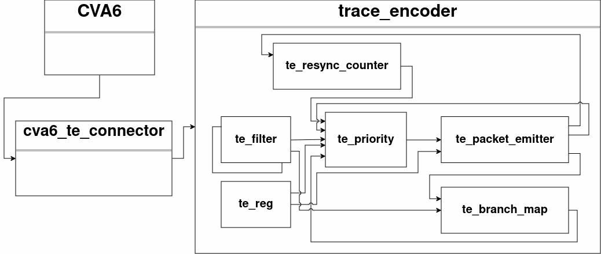
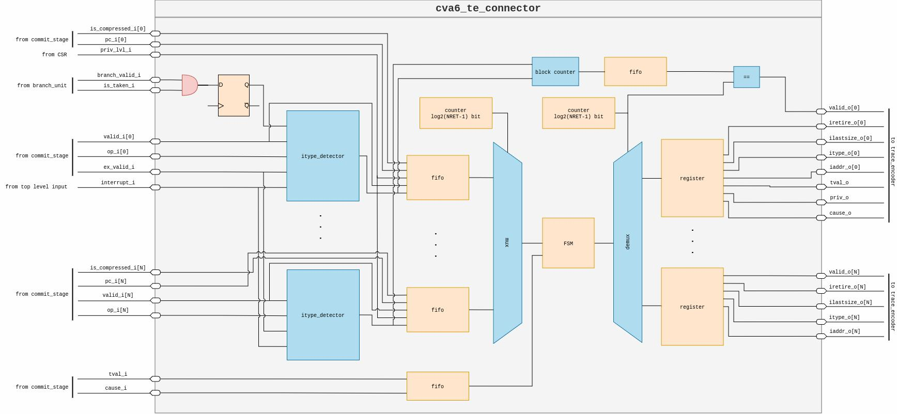
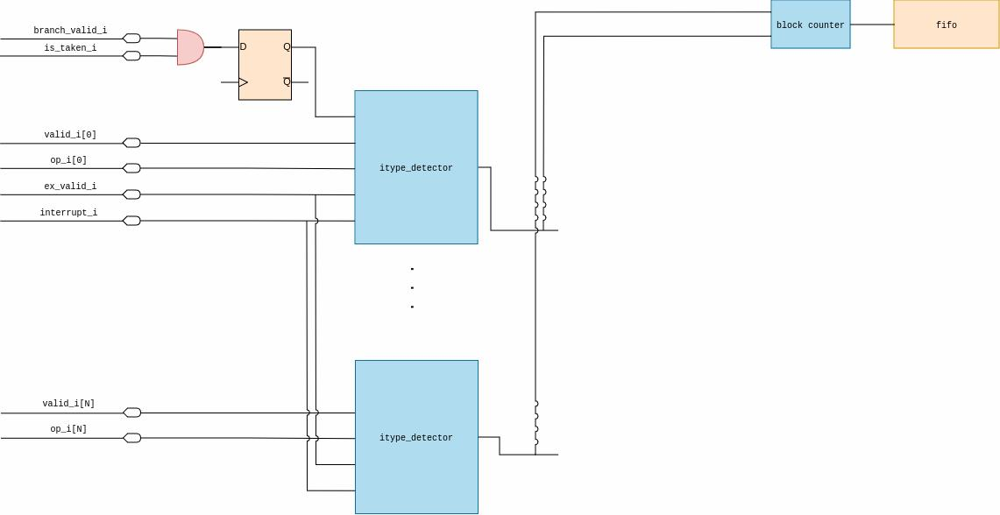
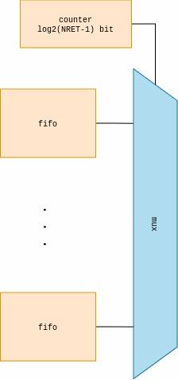
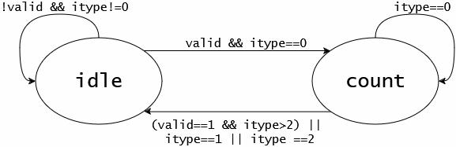
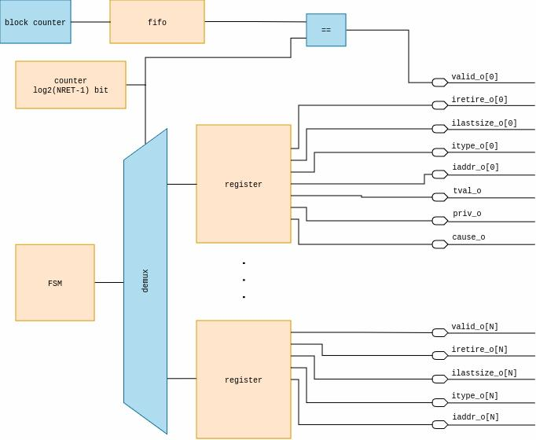

# CVA6 Trace Encoder Connector

According to the *E-Trace specification*, the mandatory inputs the *Trace Encoder* takes in are the following:

- *itype*, the termination type, so what the last instruction is;
- *cause*, the exception or interrupt cause, considered only in case of an interrupt or exception;
- *tval*, the trap value associated with exception;
- *priv*, privilege level for all instructions retired in the block;
- *iaddr*, the address of the first instruction in the block;
- *iretire*, the length of the instructions retired in the block expressed in halfwords;
- *ilastsize*, the size of the last retired instruction expressed in $2^{ilastsize}$ halfwords

No RISC-V CPU generates the aforementioned signals, necessitating an *interface module* that converts these CPU signals into a format comprehensible by the TE.

The E-Trace specification does not address this module, leaving its design to the discretion of the designer.

The module that has been implemented is studied specifically for the CVA6 CPU; however, it can be easily adapted for use with the Snitch core. Given it is designed to work as an interface for CVA6, the `cva6_te_connector` can manage N commit ports and process up to N instructions committed per cycle.

This module captures the instructions executed by the core, along with exceptions and interrupts, and generates the necessary inputs for the TE.

  

      
  

*Figure: Whole system architecture including cva6_te_connector*

The main idea is to process one instruction at a time and generate the blocks along with their information. This processing is done *by instruction* and not by cycle because the blocks can be split along multiple cycles, making an FSM the best solution to tackle this problem.

Since a CPU can retire up to N instructions, this module is structured to be easily parametrizable and adaptable to different CPU configurations.

In order to determine the info for the blocks to output, the following data are required for each commit port:

- If an instruction is committed;
- If the instruction is compressed;
- The PC value of the instruction;
- The operation type of the instruction;
- If the instruction is a branch;
- If the branch is taken or not.

Then, the following common information is required:

- If an exception or interrupt occurs;
- The cause and `tval` associated with interrupt and exception.

## CVA6 core

CVA6 is a 6-stage, single-issue, in-order CPU which implements the 64-bit RISC-V instruction set. It fully implements I, M, A, and C extensions as specified in Volume I: User-Level ISA V 2.3 as well as the draft privilege extension 1.10. It implements three privilege levels: M, S, U to fully support a Unix-like operating system.

The architecture is the following:  

  

    
  

*Figure: CVA6 internal architecture*

The commit stage is most interesting to us because it is the final stage of the pipeline in which the instructions are completed, and results are committed. The commit stage of CVA6 can output up to N instructions per cycle, where N is set as 2 by default, and the tracer must be able to track all the commit ports of the CPU to obtain a correct trace.

By using the output of the commit stage, it is possible to extrapolate all the necessary information to perform a proper branch trace.

As we'll see in the next portion of the document, these signals are necessary to determine the blocks and their fields.

## Design

On a high level, this module takes the instructions committed by the CPU and stores them inside FIFOs. Then, these instructions are fed into an *FSM* that computes the parameters for each block and then outputs them.

  

    
  

*Figure: cva6_te_connector internal architecture*

### itype_detector module

A fundamental part of the design is the `itype_detector`, whose objective is to determine the `itype` of the instruction. This is done by checking the operation associated with a committed instruction and checking if an exception or interrupt occurs in the same cycle. The branch-associated inputs are stored in a register because, in CVA6 simulated waveforms, these signals were asserted N cycles before the instruction commitment.

  

    
  

*Figure: itype_detector associated logic*

The `itype` determination is done by a combinational network, so the result is ideally available in one cycle.

After the `itype` of the input instructions is detected, another combinational network counts the number of blocks that will be output in one cycle by counting the number of `itype`s different from 0. This value is stored in a FIFO to save the result until the previous N blocks are output.

### Serialization

Since more instructions can be committed than are processed, a FIFO is used for each commit port to work as an elastic buffer and store information without stalling the rest of the pipeline.

Then, instructions need to be fed inside the FSM that determines the block fields, using a counter that operates a multiplexer, which each cycle sends to the FSM values stored in a different FIFO.

If an exception or interrupt is encountered, the counter outputs only the first FIFO to prevent sending multiple exception or interrupt `itype`s to the FSM. This behavior is caused by exception and interrupt signals being connected to all `itype_detector`s.

  

    
  

*Figure: Serialization logic*

### Finite State Machine

The FSM is the core of this module, processing one instruction at a time, and when a block is ready, it outputs the fields, which are stored in a register if necessary.

The FSM has two states:

- *idle*, where the starting values are set;
- *count*, where the final parameters are set.

  

    
  

*Figure: FSM states chart*

More precisely, in the *idle* state:

- `iaddr` is set as the address of the `itype == 0` instruction;
- `iretire` is incremented by 1 or 2, depending on the compressed input;
- `ilastsize` is set in case the first instruction is a special instruction; in the scenario in which in the clock cycle of the special instruction no instruction is committed, the `ilastsize` value is read from a register.

The FSM transitions to the *count* state if the instruction is a standard one. Otherwise, it populates the block fields and remains in this state, waiting for the next block to begin.

In the *count* state:

- `iretire` is incremented;
- `ilastsize` is set in case of an exception or interrupt without a committed instruction;
- privilege level is set.

The FSM stays in this state while committed standard instructions are read.

In both states, the `cause` and `tval` fields are populated only if there’s an interrupt or exception; otherwise, they remain 0.

### Deserialization

Since up to N blocks can be output per cycle, the `cva6_te_connector` module parallelizes the blocks produced by the FSM. A demultiplexer operated by a counter stores each block emitted by the FSM inside a register.

  

    
  

*Figure: Deserialization logic*

When all the blocks are ready - checked by comparing the value in the block number FIFO to the counter value - the `valid` signal associated with the module output is asserted, and data can be read by the TE.